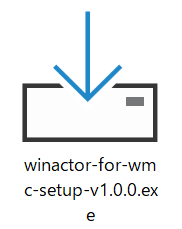
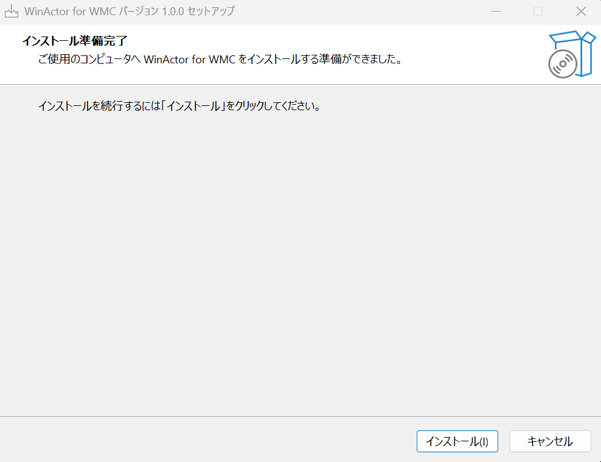
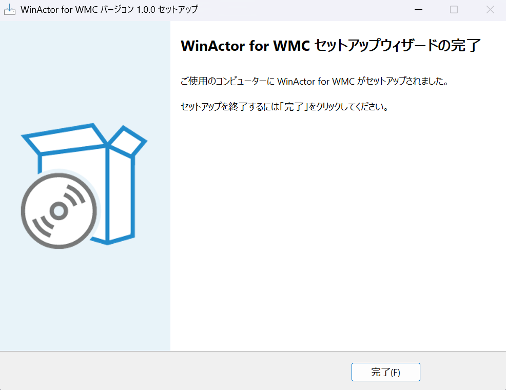

# WinActor for WMC のインストール

WinActor for WMC のセットアップを実行し、関連ファイルをインストールします。

## インストール手順

1. 解凍したフォルダ内の `winactor-for-wmc-setup-v{バージョン番号}.exe` を実行します

    

2. セットアップウィザードが表示されます。「インストール」をクリックします

    

3. インストールが完了したら「完了」をクリックします

    

!!! warning "重要"
    インストールを実行する前に、[ライセンス認証](license.md) が完了していることを確認してください。
