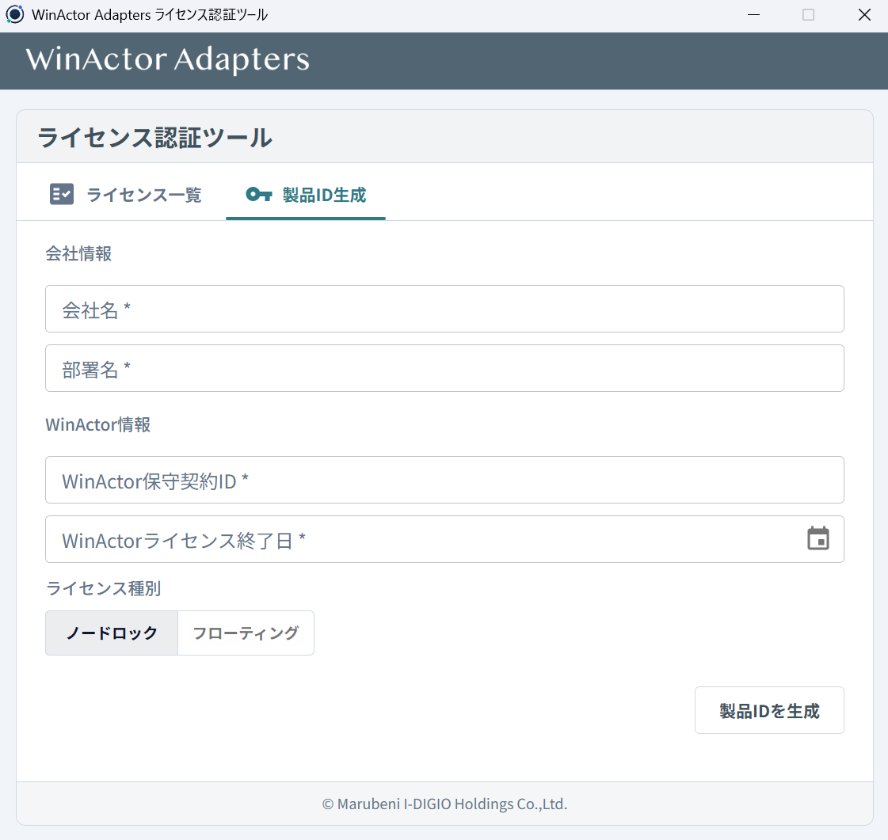
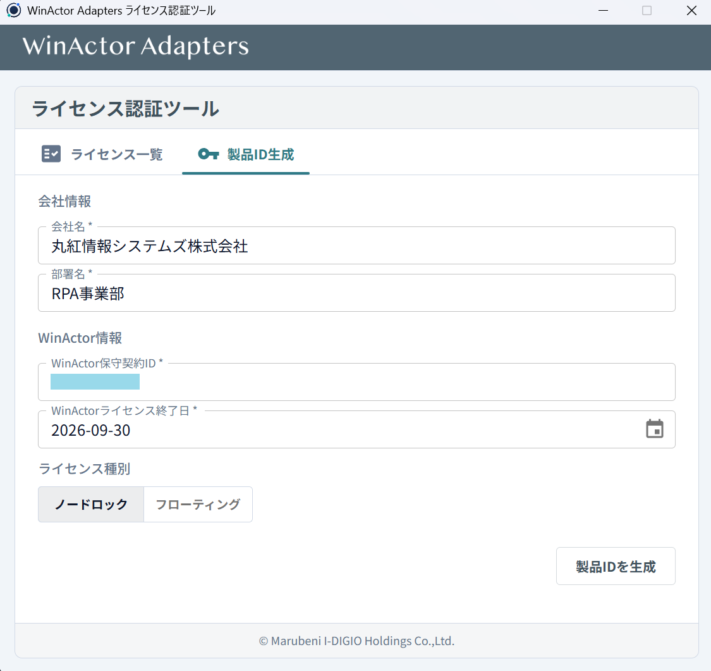
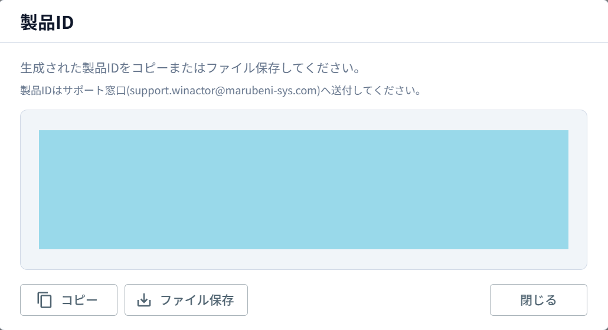
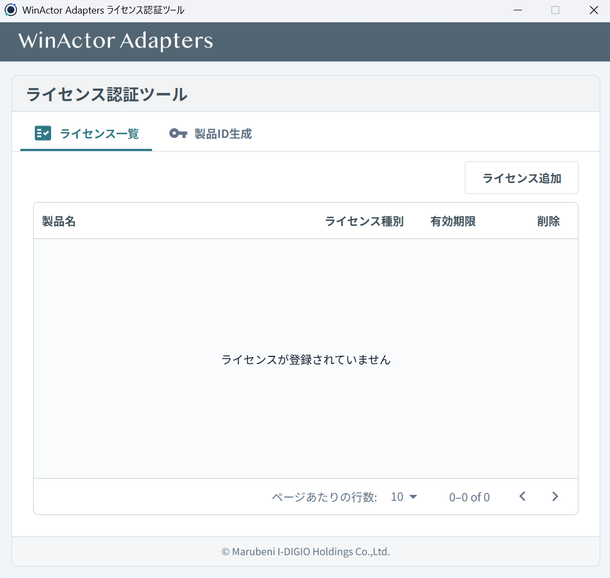
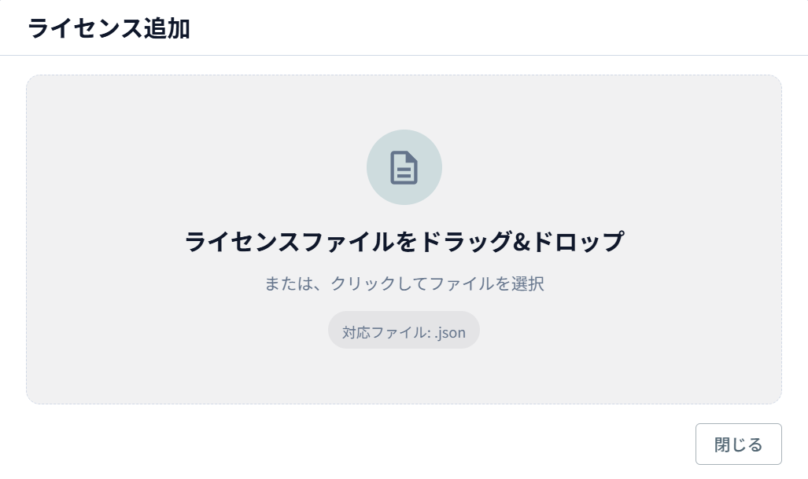
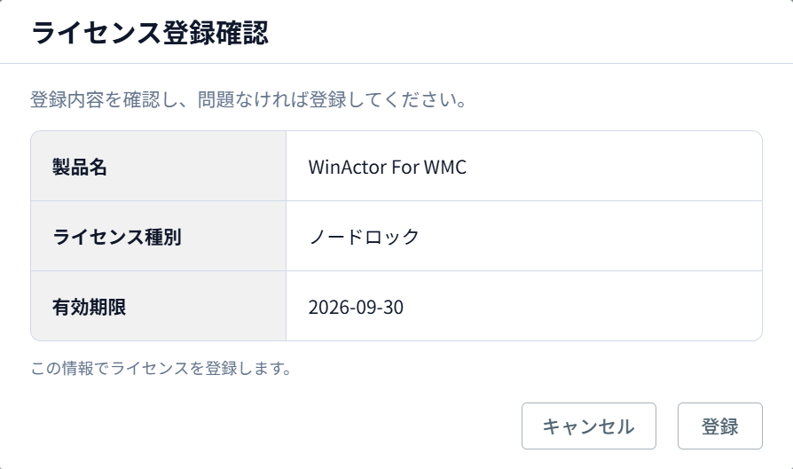
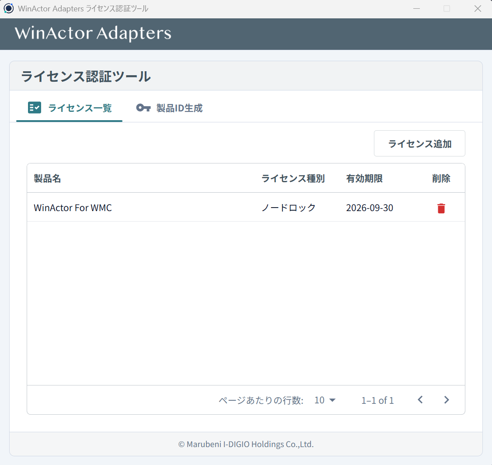
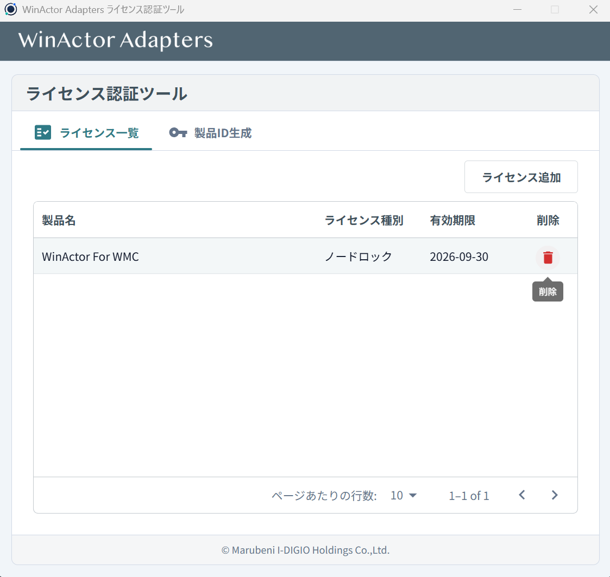
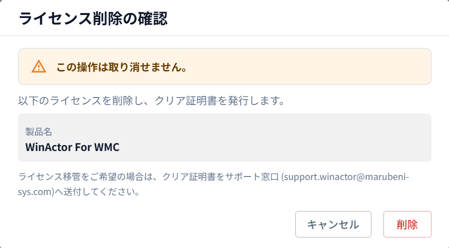

# ライセンス認証

MSYS WinActor Adapters ライセンス認証ツールは、MSYS 提供の全 WinActor アダプタ共通のライセンス管理アプリケーションです。製品 ID の生成からライセンスの登録・削除・移管までを統合的に行います。

## 起動方法

解凍したフォルダ内の `ライセンス認証ツール` フォルダにある `winactor-adapters-license-authenticator.exe` を起動します。

!!! tip
    インストール作業は不要です。exe を直接実行してください。

## ライセンス種別と認証フロー

利用するライセンスの形態によって、認証完了までのステップが異なります。

### ノードロック (NL)

特定の端末に紐づくライセンスです。**利用する端末ごと**に全手順を実施します。

[Step 1：製品 ID の生成](#step1) → [Step 2：製品 ID の送付](#step2) → [ライセンスの登録](#license-registration)

### フローティング (FL)

端末に紐づかないライセンスです。製品 ID の生成は**代表の 1 台**で行い、ライセンスの登録は**利用する各端末**で行います。

[Step 1：製品 ID の生成（代表 1 台）](#step1) → [Step 2：製品 ID の送付](#step2) → [ライセンスの登録（各端末）](#license-registration)

### トライアル

評価・検証を目的とした期間限定版です。製品 ID の生成・送付は不要です。

[ライセンスの登録](#license-registration) のみ

!!! note
    トライアルライセンスには有効期限があります。継続利用をご希望の場合は弊社営業担当までお問い合わせください。

## 認証手順（ノードロック / フローティング）

### Step 1：製品 ID の生成 { #step1 }

1. 「製品 ID 生成」タブを開きます

    

2. 会社名・部署名・WinActor 保守契約 ID・WinActor ライセンス終了日を入力します

    

3. ライセンス種別（ノードロック または フローティング）を選択します
4. 「製品 ID を生成」ボタンをクリックします
5. 製品 ID が表示されるので、「コピー」でクリップボードにコピーするか「ファイル保存」でファイルに保存します

    

### Step 2：製品 ID の送付 { #step2 }

以下の宛先に製品 ID を送付します。

- **送付先**: [support.winactor@marubeni-sys.com](mailto:support.winactor@marubeni-sys.com)

??? quote ":material-email-outline: メールテンプレート"
    **件名**: 【ライセンス申請】WinActor for WMC ライセンス発行依頼

    ```
    下記ライセンスの発行をお願いします。

    ■ 担当者名：（ご担当者名）
    ■ 対象アダプタ：WinActor for WMC
    ■ 製品 ID：（貼り付け、またはファイルを添付）
    ```

弊社にてライセンスファイル（`.json`）を発行し、返送いたします。

## ライセンスの登録 { #license-registration }

全ライセンス種別（ノードロック・フローティング・トライアル）共通の手順です。

!!! tip
    トライアルの場合は製品 ID の生成・送付（Step 1・2）は不要です。ライセンスファイルの受領後、この手順から開始してください。

1. 「ライセンス一覧」タブを開きます

    

2. 「ライセンス追加」ボタンをクリックします
3. ライセンスファイル（`.json`）をドラッグ＆ドロップまたはファイル選択で取り込みます

    

4. 確認画面が表示されるので、ライセンス情報（製品名・種別・有効期限）を確認し「登録」をクリックします

    

5. ライセンス一覧にライセンスが追加されたことを確認します

    

## ライセンスの削除

1. ライセンス一覧で対象のライセンスにカーソルを合わせ、削除アイコンをクリックします

    

2. 確認ダイアログで対象の製品名を確認し「削除」をクリックします

    

3. 削除完了後、**ライセンスクリア証明書**が自動的に生成・保存されます

## ライセンスの移管（PC リプレース・故障時）

### 旧端末での作業

1. ライセンス一覧から該当ライセンスを削除します
2. 自動生成される「ライセンスクリア証明書」を保存します
3. クリア証明書を弊社担当者に送付します

### 新端末での作業

1. 新端末で本ツールを起動し、「製品 ID 生成」タブで新しい製品 ID を生成します
2. 生成した製品 ID を弊社担当者に送付します
3. 再発行されたライセンスファイルを受領し、登録します

## 有効期限について

- 有効期限が切れたライセンスには **90 日間の猶予期間** があります。猶予期間中は警告が表示されますが、ライブラリは引き続き使用可能です
- 猶予期間を過ぎるとライブラリが使用できなくなります。新しいライセンスを登録してください

## トラブルシューティング

??? question "ライセンスファイルの登録に失敗する"
    ライセンスファイルが正しい形式であること、ファイルが破損していないことを確認してください。また、ライセンスの有効期限や認証期限が切れていないか確認してください。

??? question "「この端末用ではありません」と表示される"
    ノードロック（NL）ライセンスの場合、ライセンスが発行された端末と現在の端末のハードウェア情報が一致する必要があります。製品 ID の生成をやり直し、正しい端末でライセンスの再発行を依頼してください。

??? question "製品 ID が生成できない"
    すべての必須項目（会社名・部署名・保守契約 ID・ライセンス終了日）が入力されていることを確認してください。

??? question "ライセンスを別の端末に移行したい"
    現在の端末でライセンスを削除し、クリア証明書を取得してください。その後、新しい端末で製品 ID を再生成し、ライセンスの再発行を依頼してください。詳しくは「ライセンスの移管」セクションをご参照ください。

??? question "トライアルライセンスの期限が切れた"
    トライアル期間終了後は、正式版のライセンスを取得する必要があります。弊社営業担当までお問い合わせください。
